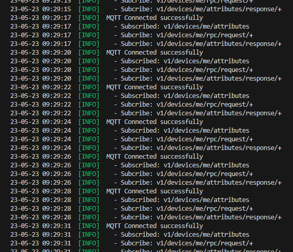

# iVIT-I-WebAPI-Fast
the faster web api for iVIT-I

# Outline
- [iVIT-I-WebAPI-Fast](#ivit-i-webapi-fast)
- [Outline](#outline)
- [Requirements](#requirements)
- [Quick Start](#quick-start)
- [About Configuration](#about-configuration)
- [About Scripts](#about-scripts)
- [Web API Documentation](#web-api-documentation)
- [Reference](#reference)
- [Troubleshooting](#troubleshooting)
- [Developement](#developement)


# Requirements
* [Docker 20.10 + ](https://docs.docker.com/engine/install/ubuntu/)
* [Docker-Compose v2.15.1 ](https://docs.docker.com/compose/install/linux/#install-using-the-repository)
    * you can check via `docker compose version`


# Quick Start
* Download Repository

    *** **NOTICE: Must use `--recurse-submodules` to clone repository or you gonna lose submodules** ***
    ```bash
    git clone -b r1.1 --recurse-submodules https://github.com/MaxChangInnodisk/ivit-i-web-api-fast.git && cd ivit-i-web-api-fast
    ```
* Choose a platform you want
    * Modify `PLATFORM` and `FRAMEWORK` in `ivit-i.json`. 
        | PLATFORM  |   FRAMEWORK
        |   ---     |   ---
        | intel     |   openvino
        | xilinx    |   vitis-ai
        | hailo     |   hailort
        | nvidia    |   tensorrt
        | jetson    |   tensorrt

* Run `iVIT-I-Web-Api`
    ```bash
    sudo ./docker/run.sh -q
    ```

# About Configuration
* [Configuration File: `ivit-i.json`](ivit-i.json)
    | KEY | Desc
    | --- | --- 
    | `PLATFORM`    |   Support key is `intel`, `xilinx`.
    | `SERVICE`     |   Support to modify Web Service `PORT`.
    | `ICAP`        |   Support to modify `HOST`, `PORT`, and `DEVICE_NAME` (iCAP register name).
    | `NGINX`       |   Support to modify Nginx `PORT`.


# About Scripts
* Scripts 
    * Build: [`docker/build.sh`](./docker/build.sh)
    * Run: [`docker/run.sh`](./docker/run.sh)
    * Stop: [`docker/stop.sh`](./docker/stop.sh)

* Run **another platform**
    Modify the `PLATFORM` key in [`ivit-i.json`](./ivit-i.json)
    ```json
    {
        "PLATFORM": "xilinx",
        "FRAMEWORK": "vitis-ai"
    }
    ```

* Enter docker container with interative mode.
    ```bash
    # Enter with command line mode
    sudo ./docker/run.sh -qc

    # Run fastapi
    python3 main.py
    ```
* Run in background
    ```bash
    # Background mode
    sudo ./docker/run.sh -qb

    # Close with another script 
    sudo ./docker/stop.sh
    ```
* More Options
    ```bash
    Run the iVIT-I environment.

    Syntax: scriptTemplate [-bcpqh]
    options:
    b               Run in background.
    c               Run command line mode.
    p               Select a platform to run ( the priority is higher than ivit-i.json ). support in [ 'intel', 'xilinx' ]
    q               Qucik start.
    h               help.
    ```

# Web API Documentation
*** *Make sure the web API service has already been launched.* ***
* The documentation will be mounted at `<ip>:<nginx_port>/ivit/docs`
* [FastAPI Swagger ( http://127.0.0.1:6632/ivit/docs )](http://127.0.0.1:6632/ivit/docs)


# Reference
* [bluenviron/mediamtx](https://github.com/bluenviron/mediamtx)
* [deepch/RTSPtoWeb](https://github.com/deepch/RTSPtoWeb)
* [nginx](https://www.nginx.com/)

# Build Web Site for ARM
Only `aarch64` have to rebuild website service, like `xilinx`, `jetson` platform. More detail please visit [iviti-wa](https://github.com/Jordan00000007/iviti-wa)
    
1. Download repository
    ```bash
    git clone -b v1.0.3 https://github.com/Jordan00000007/iviti-wa && cd iviti-wa
    ```
2. Rebuild docker image
    ```bash
    docker-compose -f ./docker-compose-pro.yml build
    ```

# Troubleshooting
1. Keep re-connect to MQTT ( iCAP ).
    * Issue
        
        

    * Solution
        Duplicate name on iCAP server, please modify `DEVICE_NAME` in `ivit-i.json`
        ```JSON
        {
            "ICAP": {
                "DEVICE_NAME": "Your Custom Name"
            }
        }
        ```


# Developement
* Add new platform
   1. Modify ivit-i.json
      * `PLATFORM` & `FRAMEWORK`
   2. Build docker image.
   3. Add a run script that should name with `run-{platform}.sh`
   4. Add samples: `./samples/{platform}_sample.py`
      * Update the zip file on the AI Model Zoo which must include a configuration file.
      * Add classification sample
      * Add object detection sample
   5. Verify classification sample
   6. Verify object detection sample
