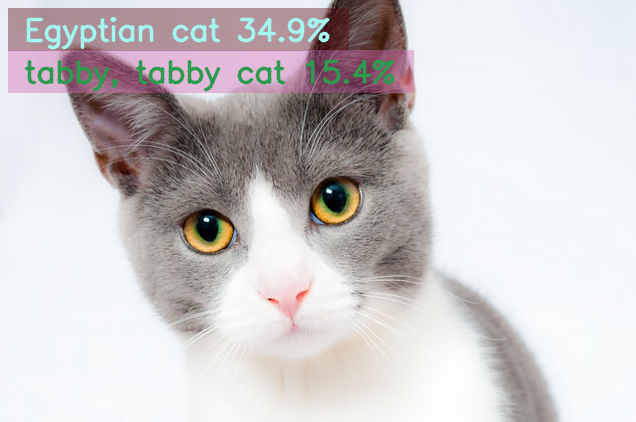

# IVIT-I-APP
AI Application Zoo For iVIT-I
* [Pre-requirements](#pre-requirements)
* [Prepare Environment](#prepare-environment)
# Application

* [Basic Classification](#basic-classification)
* [Basic Object Detection](#basic-object-detection)
* [Detection Zone](#detection-zone)
* [Tracking Zone](#tracking-zone)
* [Movement Zone](#movement-zone)

# Prepare Environment
Please based on your device to clone repository of IVIT-I. 
Support platform can see table below.

1. [Intel](https://github.com/InnoIPA/ivit-i-intel)
2. [Nvidia](https://github.com/InnoIPA/ivit-i-nvidia)
3. [Nvidia jetson](https://github.com/InnoIPA/ivit-i-jetson)
4. [xilinx](https://github.com/InnoIPA/ivit-i-xilinx)
5. [Hailo](https://github.com/MaxChangInnodisk/ivit-i-hailo)

Download apps module to your IVIT-I.
```bash
    sudo ./samples/apps_samples/classification/download_apps_module.sh 
```

 

# Basic Classification
  
More information about how to use this application [here](./docs/Basic_Classification.md).    
Add Functions.
* User can display objects they want to see. 
* User can set color for specific object.

# Basic Object Detection
  
More information about how to use this application [here](./docs/Basic_Object_Detection.md).    
Add Functions.
* User can display objects they want to see. 
* User can set color for specific object.

# Detection Zone
  
More information about how to use this application [here](./docs/Detection_Zone.md).  
Add Functions.
* User can display objects they want to see. 
* User can set color for specific object.
* User can set detection area.
* User can count number for specific object which in the detection area.
# Tracking Zone
  
More information about how to use this application [here](./docs/Tracking_Zone.md).  
Add Functions.
* User can display objects they want to see. 
* User can set color for specific object.
* User can set detection area.
* User can count number for each object once.
* User can track mutiple object.
# Movement Zone
  

More information about how to use this application [here](./docs/Movement_Zone.md).  
Add Functions.
* User can display objects they want to see. 
* User can set color for specific object.
* User can set detection area.
* User can count number for each object once.
* User can track mutiple object.
* User can get direction.

