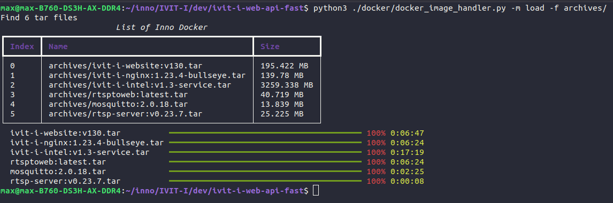

# Load iVIT-I Image for the user without internet
1. Install requirements for the script.
    * `Python 3.10` 
        ```bash
        sudo apt-get install python3-dev python3-pip
        ```
    * `Python Module` - `dih`
        ```bash
        pip3 install dih
        ```

1. Prepare the `tarball` file of each micro-services from `Innodisk`.
    * Please contact kuande_ho@innodisk.com to get more details.

1. Place it in the same folder, e.g. "./v1.3-images".
    ```bash
    v1.3-images/
    ├── ivit-i-intel:v1.3-service.tar
    ├── ivit-i-nginx:1.23.4-bullseye.tar
    ├── ivit-i-website:v130.tar
    ├── mosquitto:2.0.18.tar
    ├── rtsp-server:v0.23.7.tar
    └── rtsptoweb:latest.tar
    ```
2. Run the script to import each image from the tarball file.
    ```bash
    cd <path/to/ivit-i-web-api-fast>
    dih load -f ./v1.3-images -c ./docker/compose.yml
    ```
3. Waiting for the process to be finished.
    

