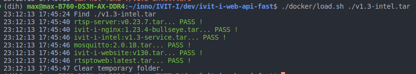

# Load iVIT-I Image for the user without internet
1. Prepare the ivit-i-web-api-fast repo. ([release page](https://github.com/InnoIPA/ivit-i-web-api-fast/releases))
2. Prepare the `tarball` file from `Innodisk`.

    * Please contact kuande_ho@innodisk.com to get more details.

3. Run the command below.
    ```bash
    ./docker/load.sh <path/to/tarball>
    ```
4. The result will be similar to the following image.
    
