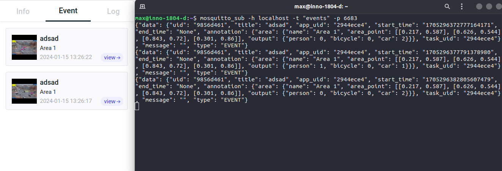
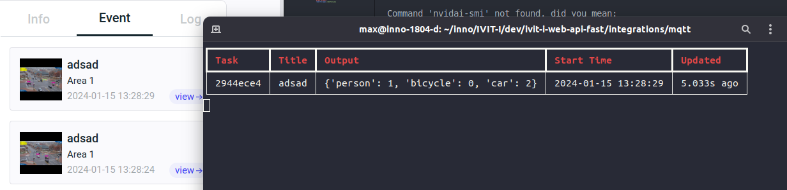
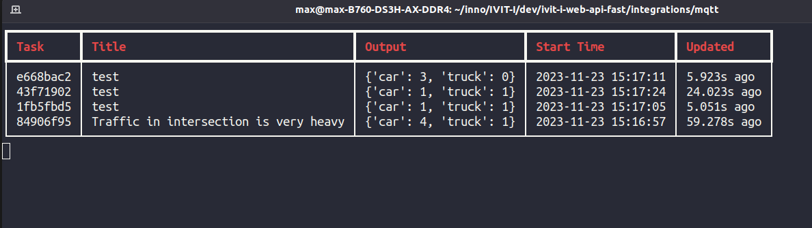

# Intergrate with MQTT


1. Use `Mosquitto` client
    1. Install `Mosquitto` client
        ```
        sudo apt-get install mosquitto-clients 
        ```
    2. Subscribe the topic
        * To get all events   
            ```bash
            mosquitto_sub -h localhost -t "events" -p 6683
            ```

        * To get target events
            ```bash
            mosquitto_sub -h localhost -t "events/<uid>" -p 6683
            ```
    3. `Mosquitto` Results
        <details style="margin-top:0.5em; margin-bottom:0.5em">
            <summary>Screenshot</summary>
            <div style="margin-left:1em;margin-top:1em">
                
            </div>
        </details>

2. Use python script (`paho` ).
   1. Install modules
        ```bash
        pip install paho-mqtt rich
        ```
   2. Run Sample
        ```bash
        # mqtt_sample is the basic sample
        # python3 mqtt_sample.py -i 127.0.0.1 -p 6683
        
        # mqtt_table_sample.py has a beautiful table to record each event output
        python3 mqtt_table_sample.py -i 127.0.0.1 -p 6683 
        ```
    3. Results
        <details style="margin-top:0.5em; margin-bottom:0.5em">
            <summary>Single Event</summary>
            <div style="margin-left:1em;margin-top:1em">
                
            </div>
        </details>
        <details style="margin-top:0.5em; margin-bottom:0.5em">
            <summary>Multiple Event</summary>
            <div style="margin-left:1em;margin-top:1em">
                
            </div>
        </details>
