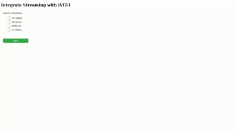

# Integrate streaming with iVIT-I ( MSE )
iVIT-I support WebRTC and MSE streaming to integration.

# Features
1. The API about streaming.
2. The MSE usage of the stream.

# MSE with Grid Monitor
1. Launch iVIT-I and execute at least one AI task.
2. Move to `mse` folder.
3. Double click the [`grid-monitor.html`](./figures/grid-monitor.html).
   