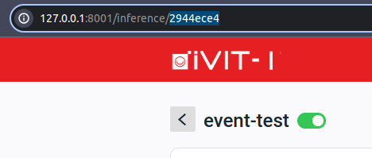
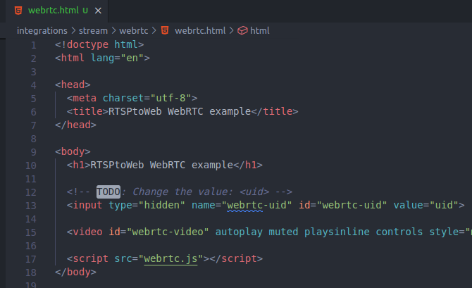
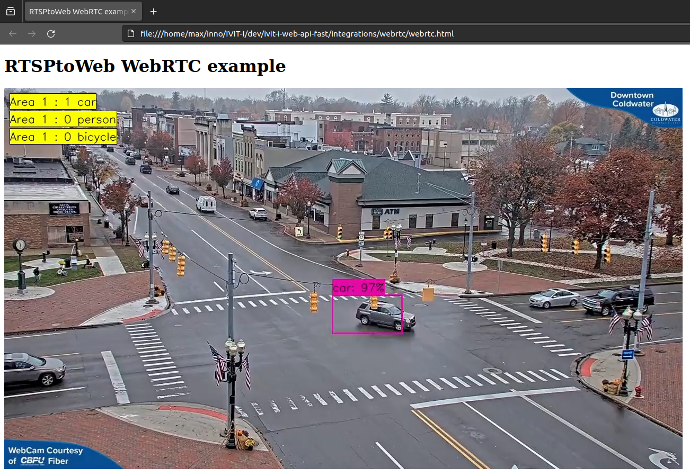

# Integrate streaming with iVIT-I ( WebRTC )
iVIT-I support WebRTC and MSE streaming to integration.

# Features
1. The API about streaming.
2. The WebRTC usage of the stream.

# WebRTC
1. Launch iVIT-I and execute at least one AI task.
   

      
Copy the task uid in the url <code>{ip}:{port}/inference/{uid}</code>

      

            
      

   

2. Modify the [`webrtc.html`](./webrtc.html) with the task uid.
   
   

      
Modify the value of the input element ( Line 13 )

      

            
      

   

3. Move to `webrtc` folder and double click the [`webrtc.html`](./webrtc.html)

   

   